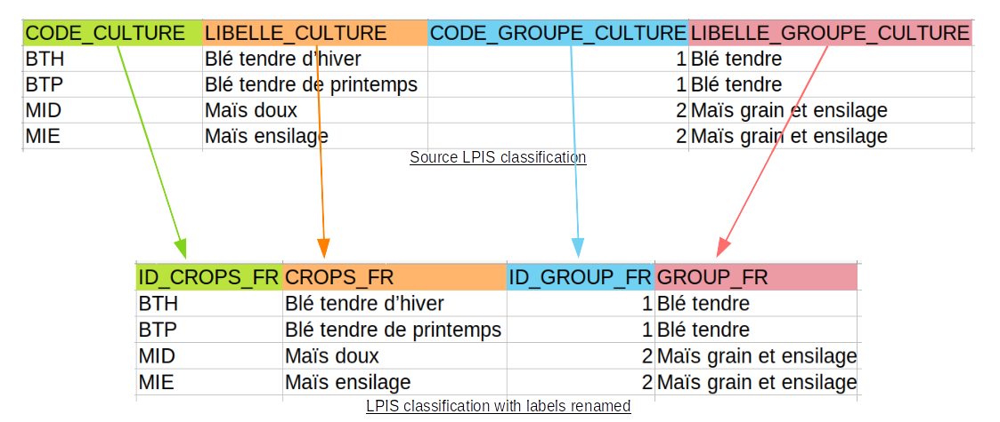

How-to-guide
==============
- :ref:`How to convert my regional or national LPIS classification to the ICC ?`
- :ref:`How to compare handmade and scriptmade conversion tables ?`

.. _How to convert my regional or national LPIS classification to the ICC ?:

How to convert my regional or national LPIS classification to the ICC ? 
------------------------------------------------------------------------
#. :ref:`Download the LPIS classification`
#. :ref:`Rename the classification labels`
#. :ref:`Go to the scripts_Classificrops folder`
#. :ref:`Choose your inputs`
#. :ref:`Run` the script parser.py with the source classification path and the inputs chosen in parameters

Step by step
-------------

.. _Download the LPIS classification:

Download the LPIS classification
~~~~~~~~~~~~~~~~~~~~~~~~~~~~~~~~~
First, the source LPIS classification should be downloaded at CSV format. It can be found in the LPIS website of the country/region under study. 
Here is a an index of 3 LPIS classifications references: 

.. _WL_url_c: https://geoservices.wallonie.be/arcgis/rest/services/AGRICULTURE/SIGEC_PARC_AGRI_ANON__2020/MapServer/legend 
.. _FR_url_c: https://geoservices.ign.fr/documentation/donnees/vecteur/rpg
.. _CAT_url_c: http://agricultura.gencat.cat/ca/ambits/desenvolupament-rural/sigpac/mapa-cultius/

+-----------+-------------+------------------------------------------------------------------------------------------------------------------+
| Area      | url         | note                                                                                                             |
+===========+=============+==================================================================================================================+
| Wallonia  | `WL_url_c`_ | It can be downloaded in csv format from html website with the script src/modules/download/download_WL_to_csv.py  |
+-----------+-------------+------------------------------------------------------------------------------------------------------------------+
| France    | `FR_url_c`_ | The LPIS classification is called "Table référentielle des cultures et des groupes de cultures"                  |
+-----------+-------------+------------------------------------------------------------------------------------------------------------------+
| Catalonia | `CAT_url_c`_| To extract the LPIS classification from Catalonia, you need to download the LPIS data, open it in QGIS, and make |
|           |             | a request on the attributes table to extract unique "Cultiu". You can stock the result into a csv file, and      |
|           |             | lower every items using : src/modules/download/download_WL_to_csv.py                                             |
+-----------+-------------+------------------------------------------------------------------------------------------------------------------+
The LPIS classifications from Wallonia, France and Catalonia are already downloaded and prepared for the year 2020 : 
::

    Classificrops
    ├── data          
    │   ├── CAT
    |   │   └── CAT_2020.csv
    │   └── FR
    |   |   └── FR_2020.csv
    │   └── WL
    |   |   └── WL_2020.csv
    
    

.. _Rename the classification labels:

Rename the classification labels
~~~~~~~~~~~~~~~~~~~~~~~~~~~~~~~~~
Rename the labels of the classification by choosing a value in each column and concatenating with an "\_". X can be replaced by a value of your choice but must be 2 or 3 capitalized letters..

+-------+---------+---------+
| ID    | class   | place   |
+=======+=========+=========+
| - ID  | - GROUP | - FR    |
| -     | - CROPS | - WL    |
|       |         | - CAT   |
|       |         | - X     |
+-------+---------+---------+

Column names examples : 
 - GROUP_CAT   
 - CROPS_CAT  
 - ID_CROPS_FR   
 - GROUP_IT (X replaced by IT that stands for Italy) 

.. _Go to the scripts_Classificrops folder:

Go to the scripts_Classificrops folder
~~~~~~~~~~~~~~~~~~~~~~~~~~~~~~~~~~~~~~
From your terminal : ``cd Classificrops/src/scripts_Classificrops``

.. _Choose your inputs:

Choose your inputs
~~~~~~~~~~~~~~~~~~

.. list-table:: Inputs choice
   :widths: 20 20 30 30
   :header-rows: 1

   * - name
     - argument
     - format
     - examples
   * - path
     - -pa
     - 
     - data/CAT/CAT_2020.csv
   * - place
     - -pl
     - 2 or 3 capitalized letters
     - CAT
   * - language
     - -l
     - 2 lowercase letters
     - cat
   * - threshold
     - -t
     - a number between 0 and 100
     - 80
   * - sim_method
     - -s
     - a string
     - token_set_ratio

If you do not get what threshold and sim_method are or if you do not want to choose them, do not pay attention to the threshold and sim_method line. 

.. _Run:

Run 
~~~
If you do not get what threshold and sim_method are or if you do not want to choose them, run :  |br|
``python3 parser.py -f converter -pa path_value -pl place_value -l language_value``  
Else, run :  |br|
``python3 parser.py -f converter -pa path_value -pl place_value -l language_value -t threshold_value -s sim_method_value``  

.. _How to test various thresholds ?:

How to compare handmade and scriptmade conversion tables for a specific similarity method ?
-------------------------------------------------------------------------------------------
#. :ref:`Download the LPIS classification`
#. :ref:`Rename the classification labels`
#. :ref:`Go to the scripts_Classificrops folder`
#. :ref:`Create the handmade conversion table`
#. :ref:`Choose your inputs 2`
#. :ref:`Run 2` the script converter.py with the source classification path and the inputs chosen in parameters. 

Note that the steps 1, 2 and 3 are the same than for the previous "how-to"

.. _Create the handmade conversion table:

Create the handmade conversion table
~~~~~~~~~~~~~~~~~~~~~~~~~~~~~~~~~~~~~

The conversion table should have 2 columns : 
 - ID\_CROPS\_ + place : corresponds to the source keys
 - ICC1.1 : corresponds to the icc classes keys. 
As an example you can see the handmade conversion tables already made for Wallonia, France and Catalonia. They are located as followed :

::

    Classificrops
    ├── data          
    │   ├── CAT
    |   │   └── handmade_Nicolas_light.csv
    │   └── FR
    |   |   └── handmade_Nicolas_light.csv
    │   └── WL
    |   |   └── handmade_Nicolas_light.csv

.. _Choose your inputs 2:

Choose your inputs 
~~~~~~~~~~~~~~~~~~~

.. list-table:: Inputs choice
   :widths: 20 20 30 30
   :header-rows: 1

   * - name
     - argument
     - format
     - examples
   * - path
     - -pa
     - 
     - data/CAT/CAT_2020.csv
   * - place
     - -pl
     - 2 or 3 capitalized letters
     - CAT
   * - language
     - -l
     - 2 lowercase letters
     - cat
   * - sim_method
     - -s
     - a string
     - token_set_ratio
   * - handmade_path
     - -hd
     - 
     - /data/FR/handmade_Nicolas_light.csv

.. _Run 2:

Run
~~~~
Run : |br|
``python3 parser.py -f optimal_threshold -pa path_value -pl place_value -l language_value -s sim_method_value -hd handmade_path_value``  

.. |br| raw:: html

       